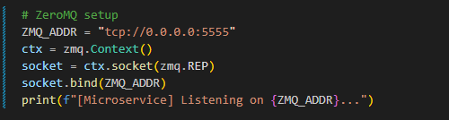
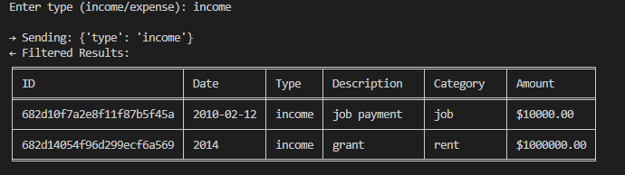

# Microservice A Communication

This microservice provides a filtering function to the existing transactions collection in MongoDB over ZeroMQ.

The endpoint is tcp://<HOST>:5555
If running locally tcp://localhost:5555 

# 1. Requesting Data

When opening the microservice it opens a ZeroMQ sockets to the microservice endpoint and the user needs to send 1 object per request, with 3 options for those requests.
    1. Filter by month
        Criteria: {"month : "YYYY-MM"}
            (Will also work if the user only enters in the year and chooses to sort by year.)
    2. Filter by type
        Criteria: {"type" : "income"}, {"type" : "expense"}
            (Will loop back if the type is invalid or none are found within the type listed)
    3. Lookup By Transaction id
        Criteria: {"id" : "<Mongo Object id>"}
            (Whatever object id is assigned to a transaction, pasting the specific transaction will list the data for that transaction.)
Example Call:

2# Recieving Data 

After sending the JSON request, the ZeroMQ recieve method is called to get the JSON response. In the response the microservice will reply with
    * List of objects from transaction menu
    * A single Transaction object from the ID lookup
    * An error if the criteria listed was invalid

UML: 